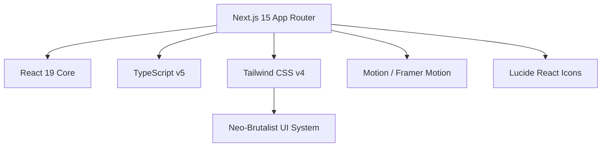

# 🏗️ VPTrokkenbau — Premium Drywall & Interior Construction Dresden

> A high-performance, search-optimized Next.js 15 web platform representing **VPTrokkenbau GmbH** — Dresden’s premier specialist contractor for high-end drywall, acoustic ceilings, certified fire protection, and museum-grade **Q4 plastering**.

---

<div align="center">

[](https://nextjs.org/)
[](https://react.dev/)
[](https://www.typescriptlang.org/)
[](https://tailwindcss.com/)
[](https://motion.dev/)
[](https://vercel.com)

</div>

---

## 💎 Project Profile & Architectural Mission

**VPTrokkenbau** delivers a premium digital showcase tailored for architects, commercial developers, and high-end residential clients in Saxony. Featuring a bold, **Neo-Brutalist design language** (high-contrast borders, solid offsets, stark highlights, and geometric structures), the platform bridges traditional German craftsmanship with cutting-edge web technologies.

The repository is engineered from the ground up to rank at the absolute top of search engine result pages (SERPs) while loading instantly on low-powered mobile devices over restrictive networks.

---

## ⚡ Engineered for Extreme Speed (Core Web Vitals)

Page speed directly correlates with lower bounce rates and higher organic rankings. The application is built with the following high-performance techniques:

### 1. Next-Generation Image Delivery (AVIF-First)
Configured natively in `next.config.ts`, the platform optimizes standard and remote images through a dual-format fallback system:
- **AVIF Preference**: Next.js automatically converts assets to the ultra-compressed **AVIF format** (saving 20–30% in payload size compared to standard WebP and up to 80% compared to JPEGs).
- **WebP Fallback**: Seamless fallback compatibility for older web browsers.
- **Lazy Loading**: Native non-blocking image rendering for below-the-fold content.

### 2. Eliminating Layout Shifts (Zero CLS)
- Fixed aspect-ratio containers prevent elements from shifting during rendering.
- Google Fonts (`Inter`) are embedded via `next/font/google` directly into the styling pipeline, pre-compiling as CSS variables to eliminate **Flash of Unstyled Text (FOUT)**.

### 3. Latency & Network Optimization
- **DNS Prefetching**: Custom HTTP response headers pre-resolve DNS lookups for external resources (e.g., Unsplash asset servers).
- **Static Site Generation (SSG)** & **Server-Side Rendering (SSR)** via Next.js App Router for immediate page paint times.

---

## 📈 Engineered for Perfect SEO (Rich Search Snippets)

This codebase implements a rigorous **Technical & On-Page SEO strategy**, ensuring search crawlers parse and reward our content:

### 🚀 Google Rich Snippets Integration (JSON-LD Schemas)
We use inline `ld+json` schema scripts to map business-relevant entities directly to Google Search.

| Page | Implemented Schema | Search Engine Benefit |
| :--- | :--- | :--- |
| **Global Layout** | `LocalBusiness` | Displays company coordinates, operating hours, telephone, and business name directly in local Google Map packs and localized searches. |
| **Leistungen** | `ItemList` of `Service` | Registers specialized services (Spachtelarbeiten Q1-Q4, Brandschutz, Akustikbau, Dachausbau) with custom descriptions, linking them to the parent provider. |
| **FAQ** | `FAQPage` | Qualifies the site for Google's rich SERP drop-down accordions, allowing users to read answer cards directly on Google, massively boosting click-through-rates (CTR). |
| **Kontakt** | `ContactPage` | Reinforces phone, email, geolocation coordinate nodes, and physical address. |

### 🛠️ Crawler Directives & Alternate Linkage
- **Dynamic Sitemap (`/sitemap.xml`)**: Generated on-the-fly inside `app/sitemap.ts` to index all main landing pages with relative priority weighting.
- **Robots Policy (`/robots.txt`)**: Controlled inside `app/robots.ts` to block indexation of admin and private endpoints, while highlighting sitemap placement.
- **HTTP `X-Robots-Tag` Header**: Configured globally in `next.config.ts` to explicitly define indexing rules (`index, follow, max-image-preview:large, max-snippet:-1`) directly at the server header layer.
- **Canonical Alternates**: Page-level metadata forces canonicalization (`https://vptrokkenbau.de/*`) to prevent duplicate content penalties across protocol domains.

---

## 🛠️ Technology Stack & Dependencies



- **Framework**: [Next.js 15.x](https://nextjs.org) (App Router, Server Actions support ready, standalone production outputs).
- **Core Engine**: [React 19.x](https://react.dev) (Concurrent rendering & server components).
- **Styles**: [Tailwind CSS v4.0](https://tailwindcss.com) utilizing the modern `@tailwindcss/postcss` builder for rapid utility compiles.
- **Animation**: [Motion](https://motion.dev) (formerly Framer Motion) for smooth micro-interactions, page entries, and transition frames.
- **Visuals**: [Lucide React](https://lucide.dev) for lean, high-fidelity vector icons.

---

## 📁 Directory Structure

```text
VPTrokkenbau/
├── .next/                  # Cached and compiled local production build files
├── app/                    # Next.js App Router root layout & routing endpoints
│   ├── faq/                # FAQ list with FAQPage schema
│   ├── karriere/           # Interactive careers portal & quick application forms
│   ├── kontakt/            # Contact desk & plan upload with ContactPage schema
│   ├── leistungen/         # Detailed service grid with ItemList Service schema
│   ├── portfolio/          # High-fidelity project filters & interactive masonry
│   ├── rechtliches/        # Legal, Imprint, and GDPR privacy policy
│   ├── globals.css         # Tailwind directives & CSS design tokens
│   ├── layout.tsx          # Global HTML wrapper, local fonts, and business schema
│   ├── page.tsx            # Main Landing / Homepage (Hero, preview panels, contact)
│   ├── robots.ts           # Dynamic robots crawler rules
│   └── sitemap.ts          # Static / dynamic sitemap generator
├── components/             # Reusable React components
│   └── layout/             # Navigation bars, Footer, and sticky CTAs
├── hooks/                  # Custom React hooks
├── lib/                    # Configuration, client connectors, and utility layers
├── public/                 # Static assets, local SVGs, and iconography
├── next.config.ts          # Next.js production server, header & image formats
├── postcss.config.mjs      # CSS compiling configurations
├── tsconfig.json           # Explicit strict TypeScript typing configurations
└── package.json            # Scripts, dependency list, and node modules manifest
```

---

## 🚀 Getting Started

Follow these steps to run the development server locally:

### 📋 Prerequisites
Ensure you have **Node.js** (v18.x or later) and **npm** (v10.x or later) installed.

### 1. Install Dependencies
```bash
npm install
```

### 2. Configure Environment variables
Create a `.env.local` file in the root folder (or rename `.env.example`):
```bash
cp .env.example .env.local
```
Add your configurations:
```env
GEMINI_API_KEY=your_gemini_api_key_here
```

### 3. Launch Development Server
```bash
npm run dev
```
Open [http://localhost:3000](http://localhost:3000) in your browser to inspect the application.

### 4. Code Formatting & Linting
Run the static analysis engine to verify code quality:
```bash
npm run lint
```

---

## 📦 Production Deployment Playbook

To compile a highly optimized, lightning-fast standalone production build:

### 1. Build the Application
```bash
npm run build
```
This command compiles the files, strips away development scripts, compresses bundle payloads, and renders static pages into `.next/`.

### 2. Local Production Preview
Test the production-ready server locally to analyze real-world speeds:
```bash
npm run start
```

### 3. Vercel / Cloud Deployment
To deploy the application directly to Vercel (recommended for Next.js):
```bash
npm install -g vercel
vercel login
vercel --prod
```

---

## 🧭 Post-Launch SEO & Marketing Checklist

Once the site is compiled and deployed, follow this blueprint to guarantee maximum search presence:

- [ ] **Google Search Console (GSC)**: Claim ownership of your domain in GSC.
- [ ] **Sitemap Submission**: Submit the canonical sitemap (`https://vptrokkenbau.de/sitemap.xml`) to GSC for instant indexation.
- [ ] **Structured Data Audit**: Paste URL paths in the [Google Rich Results Test Tool](https://search.google.com/test/rich-results) to confirm FAQ Page, Service List, and LocalBusiness JSON-LD markup are parsed without errors.
- [ ] **Google My Business**: Establish a "Google My Business" profile, aligning the address, telephone number, and opening hours exactly with `app/layout.tsx` schema coordinates.
- [ ] **Lighthouse Verification**: Run a Chrome DevTools Lighthouse audit in an incognito window to verify that **SEO** and **Performance** scores are in the green category (90–100%).

---

## 🤝 Contributing & Standards

1. **Semantic Code**: Maintain semantic HTML elements (`<section>`, `<article>`, `<header>`, `<main>`) for screen readers and SEO crawlers.
2. **Strict Typings**: Ensure all typescript classes, props, and schemas pass strict static analysis check during the build step.
3. **Optimized Imports**: Import icons individually from `lucide-react` and components via `@/components/` paths to encourage tree-shaking.

---

*Handcrafted in Saxony. Dedicated to absolute construction precision, both in drywall structural frames and semantic lines of code.*
# VPtrokkenbau2026
